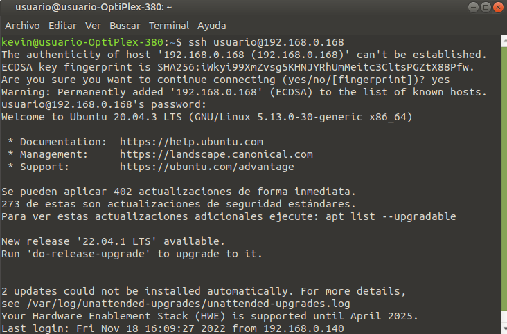
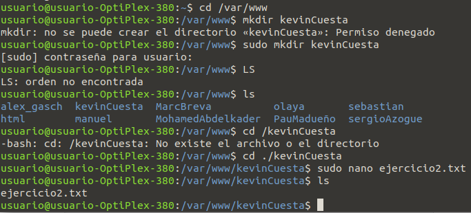

# Ejercicio 2 ssh

Lo primero que tenemos que hacer es conectarnos al ordenador con el siguiente comando: 
`ssh usuario@192.168.0.168`

Con este comando y su respectiva contraseña ya estaremos dentro del equipo.

Ahora debemos proceder a crear una carpeta en :
>/var/www
>
Para movernos usuamos el comando `cd`, luego procedemos ha hacer el comando `mkdir` para crear la carpeta con el nombre kevinCuesta.

Por ultimo debemos proceder a crear un archivo dentro de la carpeta creada en:
>/var/www/kevinCuesta

Con el comando `sudo nano Ejercicio2.txt` creamos el fichero de texto.
* Sudo: Le damos los permisos de admin para crear el fichero.
* Nano: Es un editor de texto de ubuntu gratuito. 

Utilizamos el comando `ls` para asegurarnos que el archivo este creado.

