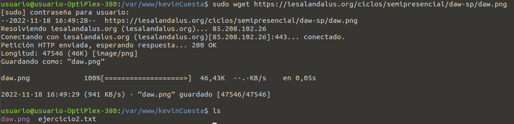

# Command Line

En este ejercicio tenemos que copiar una imagen de internet en el repositorio 

Procedemos a ir a la carpeta que hemos creado en el ejercicio anterior y usamos el comando:

`sudo wget https://iesalandalus.org/ ciclos/semipresencial/daw-sp/daw.png`

* SUDO - con `sudo` le damos permiso para que pueda descargar la imagen desde internet.
* WGET - con `wget` le decimos que descarge la imagen de la red.

